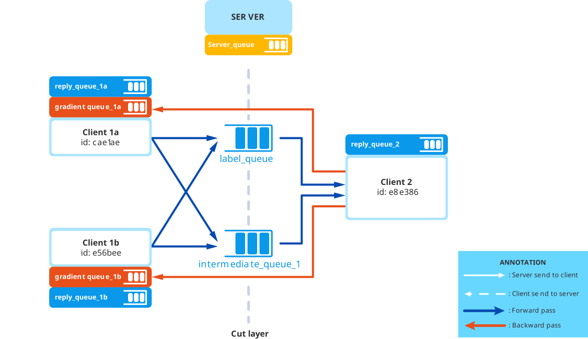

# Split Learning


## 📌 Giới thiệu
Dự án này triển khai **Split Learning** để huấn luyện mô hình **YOLO11** trên nhiều máy khác nhau, kết nối thông qua **RabbitMQ**.  
Mục tiêu:
- Bảo mật dữ liệu (dữ liệu thô không rời khỏi máy cục bộ)
- Giảm tải tính toán cho từng client
- Tăng khả năng huấn luyện phân tán

## 🏗️ Kiến trúc hệ thống
Hệ thống gồm 3 thành phần chính:

1. **Server**  
   - Quản lý luồng dữ liệu, điều phối quá trình huấn luyện  
   - Theo dõi trạng thái các client và kết quả huấn luyện  
   - Gửi/nhận tensor giữa các client thông qua **RabbitMQ**

2. **Client 1a** & **Client 1b**  
   - Thực hiện **phần đầu của mô hình YOLO11** (feature extraction ban đầu)  
   - Gửi tensor trung gian sang **Client 2** qua RabbitMQ

3. **Client 2**  
   - Nhận tensor từ Client 1a/1b  
   - Thực hiện **phần còn lại của mô hình** (prediction + loss calculation)  
   - Thực hiện **backward propagation** và gửi gradient ngược về Client 1a/1b

## 🔄 Luồng xử lý


## 🚀 Chạy với Docker Compose
Tạo file `docker-compose.yml` như sau:

```yaml
version: '3'

services:
  rabbitmq:
    image: rabbitmq:management
    container_name: rabbitmq
    ports:
      - "5672:5672"
      - "15672:15672"
    environment:
      RABBITMQ_DEFAULT_USER: user
      RABBITMQ_DEFAULT_PASS: password
    volumes:
      - rabbitmq_data:/var/lib/rabbitmq
      - ./rabbitmq_config/rabbitmq.conf:/etc/rabbitmq/rabbitmq.conf
    healthcheck:
      test: ["CMD", "rabbitmq-diagnostics", "ping"]
      interval: 5s
      timeout: 5s
      retries: 10
      start_period: 10s

  server:
    container_name: split_learning_server
    build:
      context: . 
      dockerfile: Dockerfile
    depends_on:
      rabbitmq:
        condition: service_healthy
    volumes:
      - .:/app
    working_dir: /app
    command: ["python", "server.py"]

  client_2:
    container_name: split_learning_client_2
    image: split_learning-server
    depends_on:
      rabbitmq:
        condition: service_healthy
      server:
        condition: service_started
    volumes:
      - .:/app
    working_dir: /app
    command: ["python", "client.py", "--layer_id", "2"]

  client_1_1:
    container_name: split_learning_client_1_1
    image: split_learning-server
    depends_on:
      rabbitmq:
        condition: service_healthy
      server:
        condition: service_started
    volumes:
      - .:/app
    working_dir: /app
    command: ["python", "client.py", "--layer_id", "1", "--docker"]

volumes:
  rabbitmq_data:
```

### Dockerfile
```bash
FROM ultralytics/ultralytics:latest

RUN pip install --upgrade pip

RUN pip install \
    requests==2.32.3 \
    pika==1.3.2

CMD ["bash"]

ENV PYTHONUNBUFFERED=1
```

### Chạy hệ thống
```bash
docker compose build #build images
docker compose up -d #run docker container
```

### Truy cập giao diện RabbitMQ Management
- URL: http://localhost:15672  
- User: `user`  
- Pass: `password`

## 📌 Ghi chú
- Có thể mở rộng số lượng client xử lý song song để tăng tốc độ huấn luyện
- Đảm bảo GPU đã được Docker nhận dạng khi huấn luyện với CUDA
- Các file `client.py` và `server.py` cần cấu hình địa chỉ RabbitMQ phù hợp
